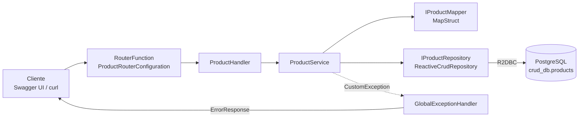

# asl-crud-spring-webflux

API REST **reactiva** para la administración de productos, construida con Spring WebFlux
(endpoints funcionales) y Spring Data R2DBC sobre PostgreSQL. Toda la cadena
`petición → servicio → base de datos` es no bloqueante.

La aplicación **levanta su propia base de datos**: al arrancar detecta `docker-compose.yml`,
inicia el contenedor de PostgreSQL, espera a que esté sano y se conecta. No hace falta ejecutar
`docker compose up` como paso independiente.

- 📘 **Swagger UI** → <http://localhost:9091/swagger-ui.html>
- 🧾 **OpenAPI 3.1** → <http://localhost:9091/v3/api-docs>
- 🏗️ **Arquitectura y diagramas** → [`docs/ARQUITECTURA.md`](docs/ARQUITECTURA.md)

---

## Tabla de contenido

1. [Stack tecnológico](#stack-tecnológico)
2. [Arquitectura en un vistazo](#arquitectura-en-un-vistazo)
3. [Requisitos previos](#requisitos-previos)
4. [Puesta en marcha](#puesta-en-marcha)
5. [Base de datos](#base-de-datos)
6. [Documentación interactiva (Swagger)](#documentación-interactiva-swagger)
7. [Endpoints](#endpoints)
8. [Contratos de datos](#contratos-de-datos)
9. [Manejo de errores](#manejo-de-errores)
10. [Configuración](#configuración)
11. [Estructura del proyecto](#estructura-del-proyecto)
12. [Comandos útiles](#comandos-útiles)
13. [Solución de problemas](#solución-de-problemas)
14. [Deuda técnica conocida](#deuda-técnica-conocida)

---

## Stack tecnológico

| Componente | Versión | Rol |
| --- | --- | --- |
| Java | 25 | Lenguaje (`<release>25</release>`) |
| Spring Boot | 4.0.4 | Framework base |
| Spring WebFlux | — | Servidor reactivo sobre Reactor Netty |
| Spring Data R2DBC | — | Acceso a datos no bloqueante |
| PostgreSQL | 17 (Alpine) | Base de datos |
| r2dbc-postgresql | 1.1.1 | Driver reactivo |
| MapStruct | 1.6.3 | Mapeo entidad ↔ DTO en tiempo de compilación |
| Lombok | 1.18.44 | Reducción de boilerplate |
| springdoc-openapi | 3.0.3 | Generación de OpenAPI + Swagger UI |
| spring-boot-docker-compose | 4.0.4 | Ciclo de vida de la base de datos local |
| Maven | 3.9.16 (wrapper incluido) | Build |

---

## Arquitectura en un vistazo



Las rutas se declaran de forma **funcional**, no con `@RestController`: `ProductRouterConfiguration`
mapea cada path a un método de `ProductHandler`, que a su vez delega en `ProductService`.
El detalle completo —diagrama de componentes, secuencia, manejo de errores, modelo de datos y
despliegue local— está en [`docs/ARQUITECTURA.md`](docs/ARQUITECTURA.md).

---

## Requisitos previos

| Requisito | Comprobación |
| --- | --- |
| **JDK 25** | `java -version` |
| **Docker Engine + Compose v2** | `docker compose version` |
| Maven | No hace falta instalarlo: usa el wrapper `./mvnw` |

> [!IMPORTANT]
> **Tu usuario debe poder hablar con Docker sin `sudo`.** La aplicación invoca la CLI de Docker
> durante el arranque; si no tiene permisos, falla antes de levantar el servidor con
> `permission denied while trying to connect to the docker API at unix:///var/run/docker.sock`.
>
> ```bash
> sudo usermod -aG docker $USER   # añade tu usuario al grupo docker
> newgrp docker                   # aplica el cambio en la sesión actual
> docker ps                       # debe responder sin sudo
> ```
>
> En algunos sistemas hay que cerrar sesión y volver a entrar para que el grupo surta efecto.
> Si prefieres no tocar permisos, consulta [Usar una base de datos externa](#usar-una-base-de-datos-externa).

---

## Puesta en marcha

### Opción 1 — Un solo comando (recomendada)

```bash
./mvnw spring-boot:run
```

Eso es todo. En ese único paso la aplicación:

1. Lee `docker-compose.yml` y levanta el contenedor `crud-webflux-postgres`.
2. Ejecuta `docker/init-db.sql` **la primera vez**, creando la tabla `products` con 3 productos de ejemplo.
3. Espera al *healthcheck* (`pg_isready`) antes de continuar.
4. Inyecta host, puerto y credenciales del contenedor en la configuración de R2DBC.
5. Arranca Reactor Netty en el puerto **9091**.

Cuando detienes la aplicación (`Ctrl+C`), el contenedor se apaga también. Para que la base de datos
siga viva entre ejecuciones, cambia en `application.properties`:

```properties
spring.docker.compose.lifecycle-management=start_only
```

### Opción 2 — Empaquetar y ejecutar el JAR

```bash
./mvnw clean package
java -jar target/asl-crud-spring-webflux-1.0.0-SNAPSHOT.jar
```

El JAR ejecutable conserva el mismo comportamiento: también levanta la base de datos, siempre que
`docker-compose.yml` esté en el directorio de trabajo desde el que ejecutas el comando.

### Opción 3 — Desde IntelliJ IDEA

Ejecuta la clase `asl.development.CrudWebflux`. Asegúrate de que el SDK del proyecto sea **JDK 25**
y de que el *working directory* de la configuración de ejecución apunte a la raíz del repositorio
(donde vive `docker-compose.yml`).

### Verificar que todo está arriba

```bash
curl -i http://localhost:9091/api/products/
```

Debe responder `200 OK` con los productos de ejemplo.

---

## Base de datos

### Qué levanta `docker-compose.yml`

| Parámetro | Valor |
| --- | --- |
| Imagen | `postgres:17-alpine` |
| Contenedor | `crud-webflux-postgres` |
| Base de datos | `crud_db` |
| Usuario / contraseña | `local` / `postgres` |
| Puerto (host → contenedor) | `5432 → 5432` |
| Volumen de datos | `crud-webflux-postgres-data` |
| Script de inicialización | `docker/init-db.sql` |

El esquema es una única tabla:

```sql
CREATE TABLE public.products (
    product_id    SERIAL PRIMARY KEY,
    product_name  VARCHAR(150) NOT NULL,
    product_price VARCHAR(50)  NOT NULL
);
```

### Manejarla manualmente (opcional)

Aunque la app la administra sola, puedes controlarla por tu cuenta:

```bash
docker compose up -d          # levanta PostgreSQL en segundo plano
docker compose ps             # estado y healthcheck
docker compose logs -f postgres
docker compose stop           # detiene sin borrar datos
docker compose down           # elimina el contenedor, conserva el volumen
docker compose down -v        # elimina TAMBIÉN los datos → init-db.sql se vuelve a ejecutar
```

Si prefieres que la aplicación no toque los contenedores porque los gestionas tú:

```properties
spring.docker.compose.lifecycle-management=none
```

### Conectarse con psql

```bash
docker exec -it crud-webflux-postgres psql -U local -d crud_db

# Dentro de psql:
\dt public.*
SELECT * FROM public.products;
```

### Restablecer el esquema desde cero

`docker/init-db.sql` sólo se ejecuta cuando el volumen de datos está vacío. Para forzar su
reejecución tras modificarlo:

```bash
docker compose down -v && ./mvnw spring-boot:run
```

### Usar una base de datos externa

Desactiva la gestión de Docker y apunta a tu instancia:

```bash
./mvnw spring-boot:run \
  -Dspring-boot.run.jvmArguments="\
    -Dspring.docker.compose.enabled=false \
    -Dspring.r2dbc.url=r2dbc:postgresql://mi-host:5432/crud_db \
    -Dspring.r2dbc.username=mi-usuario \
    -Dspring.r2dbc.password=mi-password"
```

> Mientras `spring.docker.compose.enabled=true`, los valores de `spring.r2dbc.*` del
> `application.properties` quedan **sobrescritos** por los del contenedor. Sólo se usan cuando la
> gestión de Docker está apagada.

---

## Documentación interactiva (Swagger)

Con la aplicación en marcha:

| Recurso | URL |
| --- | --- |
| Swagger UI | <http://localhost:9091/swagger-ui.html> |
| Documento OpenAPI 3.1 (JSON) | <http://localhost:9091/v3/api-docs> |
| Documento OpenAPI (YAML) | <http://localhost:9091/v3/api-docs.yaml> |

Desde Swagger UI puedes probar los cinco endpoints con **"Try it out"**: cada operación trae
descripción, parámetros, esquema del body con ejemplos y todas las respuestas posibles
(incluidos los `404` y `500` con su `ErrorResponse`).

### Cómo documentar un endpoint nuevo

Los endpoints funcionales **no se auto-documentan**: springdoc no puede inspeccionar una
`RouterFunction` como haría con un `@RestController`. Por eso la documentación se declara a mano
en `ProductRouterConfiguration` mediante `@RouterOperations`:

```java
@RouterOperations({
    @RouterOperation(
        path = "/api/products/{id}",
        method = RequestMethod.GET,
        produces = MediaType.APPLICATION_JSON_VALUE,
        operation = @Operation(
            operationId = "getProductById",
            tags = "Products",
            summary = "Consulta un producto por id",
            parameters = @Parameter(name = "id", in = ParameterIn.PATH, required = true),
            responses = { /* 200, 404, 500 */ }))
})
@Bean
public RouterFunction<ServerResponse> productRoute(ProductHandler productHandler) { … }
```

**Al agregar una ruta hay que añadir también su `@RouterOperation`**, o quedará expuesta pero
invisible en Swagger UI. Los ejemplos y descripciones de los campos viven en las anotaciones
`@Schema` de los DTO (`ProductRequest`, `ProductResponse`, `ProductResponseInfo`, `ErrorResponse`).

Para deshabilitar la documentación en un entorno concreto:

```properties
springdoc.api-docs.enabled=false
springdoc.swagger-ui.enabled=false
```

---

## Endpoints

Base: `http://localhost:9091`

| Método | Ruta | Descripción | Éxito | Errores |
| --- | --- | --- | --- | --- |
| `GET` | `/api/products/{id}` | Consulta un producto por id | `200` `ProductResponse` | `404`, `500` |
| `GET` | `/api/products/` | Lista todos los productos | `200` `ProductResponse[]` | `500` |
| `POST` | `/api/products` | Crea un producto | `201` `ProductResponseInfo` | `500` |
| `PUT` | `/api/products/{id}` | Actualiza (parcialmente) un producto | `200` `ProductResponseInfo` | `404`, `500` |
| `DELETE` | `/api/products/{id}` | Elimina un producto | `200` `ProductResponseInfo` | `404`, `500` |

> [!WARNING]
> **Ojo con la barra final.** El listado está registrado como `/api/products/` **con** barra,
> mientras que la creación usa `/api/products` **sin** barra. Un `GET /api/products` (sin barra)
> devuelve `404`. Está anotado así en Swagger para que las pruebas funcionen tal cual.

### Ejemplos

**Listar todos**

```bash
curl http://localhost:9091/api/products/
```

```json
[
  { "id": 1, "productName": "Teclado mecanico",    "productPrice": "1299.00" },
  { "id": 2, "productName": "Mouse inalambrico",   "productPrice": "499.50"  },
  { "id": 3, "productName": "Monitor 27 pulgadas", "productPrice": "5899.99" }
]
```

**Consultar por id**

```bash
curl http://localhost:9091/api/products/1
```

```json
{ "id": 1, "productName": "Teclado mecanico", "productPrice": "1299.00" }
```

**Crear**

```bash
curl -X POST http://localhost:9091/api/products \
  -H "Content-Type: application/json" \
  -d '{"name":"Webcam 1080p","price":"899.00"}'
```

```json
{ "message": "Product Created Successfully", "code": 201, "timestamp": "2026-08-19T14:30:00.123" }
```

**Actualizar** — es una actualización **parcial**: los campos omitidos (o en `null`) conservan su
valor actual.

```bash
curl -X PUT http://localhost:9091/api/products/1 \
  -H "Content-Type: application/json" \
  -d '{"price":"1199.00"}'
```

```json
{ "message": "Updated Product", "code": 200, "timestamp": "2026-08-19T14:31:00.456" }
```

**Eliminar**

```bash
curl -X DELETE http://localhost:9091/api/products/1
```

```json
{ "message": "Deleted Product", "code": 200, "timestamp": "2026-08-19T14:32:00.789" }
```

**Producto inexistente**

```bash
curl -i http://localhost:9091/api/products/9999
```

```json
{
  "message": "Product not found",
  "statusCode": 404,
  "timestamp": "2026-08-19T20:43:11.842355699Z",
  "path": "/api/products/9999"
}
```

---

## Contratos de datos

### `ProductRequest` — entrada de creación y actualización

| Campo | Tipo | Descripción |
| --- | --- | --- |
| `name` | `string` | Nombre comercial del producto |
| `price` | `string` | Precio del producto |

### `ProductResponse` — lectura

| Campo | Tipo | Descripción |
| --- | --- | --- |
| `id` | `integer` | Identificador del producto |
| `productName` | `string` | Nombre comercial |
| `productPrice` | `string` | Precio |

### `ProductResponseInfo` — acuse de operaciones de escritura

| Campo | Tipo | Descripción |
| --- | --- | --- |
| `message` | `string` | Resultado de la operación |
| `code` | `integer` | Código HTTP asociado |
| `timestamp` | `date-time` | Momento de la operación |

### `ErrorResponse` — contrato único de error

| Campo | Tipo | Descripción |
| --- | --- | --- |
| `message` | `string` | Descripción del error |
| `statusCode` | `integer` | Código HTTP |
| `timestamp` | `date-time` | Momento del error (UTC) |
| `path` | `string` | Ruta que lo originó |

### Correspondencia con la tabla

| Columna | Entidad `Product` | `ProductRequest` | `ProductResponse` |
| --- | --- | --- | --- |
| `product_id` | `id` | — | `id` |
| `product_name` | `name` | `name` | `productName` |
| `product_price` | `price` | `price` | `productPrice` |

El renombrado lo resuelve `IProductMapper` (MapStruct); la entidad nunca sale de la capa de servicio.

---

## Manejo de errores

`GlobalExceptionHandler` se registra con `@Order(-2)`, por delante del manejador por defecto de
Spring Boot, e intercepta todas las rutas. Cualquier excepción termina como un `ErrorResponse`:

| Excepción | Código | Mensaje |
| --- | --- | --- |
| `CustomException` | El que traiga la excepción | El de la excepción (p. ej. `Product not found` → `404`) |
| `NoResourceFoundException` | `404` | `Resource not found, please validate again` |
| `BadSqlGrammarException` | `500` | `Bad SQL Exception, please validate if database or table exists` |
| Cualquier otra | `500` | `Internal Server Error` |

Un `BadSqlGrammarException` casi siempre significa que la tabla `products` no existe: revisa que
`docker/init-db.sql` se haya ejecutado (`docker compose down -v` y vuelve a arrancar).

---

## Configuración

Todo vive en [`src/main/resources/application.properties`](src/main/resources/application.properties).

| Propiedad | Valor por defecto | Descripción |
| --- | --- | --- |
| `server.port` | `9091` | Puerto HTTP |
| `spring.application.name` | `crud.wefblux` | Nombre de la aplicación |
| `spring.r2dbc.url` | `r2dbc:postgresql://localhost:5432/crud_db` | URL R2DBC (respaldo si Docker Compose está apagado) |
| `spring.r2dbc.username` | `local` | Usuario |
| `spring.r2dbc.password` | `postgres` | Contraseña |
| `spring.docker.compose.enabled` | `true` | Gestión automática de la base de datos |
| `spring.docker.compose.file` | `docker-compose.yml` | Archivo Compose a utilizar |
| `spring.docker.compose.lifecycle-management` | `start_and_stop` | `start_and_stop` \| `start_only` \| `none` |
| `spring.docker.compose.readiness.timeout` | `2m` | Espera máxima al healthcheck |
| `springdoc.api-docs.path` | `/v3/api-docs` | Ruta del documento OpenAPI |
| `springdoc.swagger-ui.path` | `/swagger-ui.html` | Ruta de Swagger UI |

Cualquiera se puede sobrescribir por variable de entorno siguiendo la convención de Spring Boot
(`SERVER_PORT`, `SPRING_R2DBC_URL`, `SPRING_DOCKER_COMPOSE_ENABLED`, …).

---

## Estructura del proyecto

```
crud-spring-webflux/
├── docker-compose.yml              # PostgreSQL local (lo levanta la propia app)
├── docker/
│   └── init-db.sql                 # Esquema + datos de ejemplo (primer arranque)
├── docs/
│   ├── ARQUITECTURA.md             # Documento de arquitectura con diagramas
│   └── diagrams/                   # Diagramas Mermaid individuales (.mmd)
├── mvnw / mvnw.cmd                 # Maven wrapper
├── pom.xml
└── src/main/
    ├── java/asl/development/
    │   ├── CrudWebflux.java                        # @SpringBootApplication
    │   ├── configuration/
    │   │   ├── GlobalExceptionHandler.java         # Errores → ErrorResponse
    │   │   └── OpenApiConfiguration.java           # Metadatos OpenAPI
    │   ├── controllers/
    │   │   └── ProductRouterConfiguration.java     # Rutas + @RouterOperations
    │   ├── handler/
    │   │   └── ProductHandler.java                 # HTTP ↔ dominio
    │   ├── service/
    │   │   ├── IProductService.java
    │   │   └── ProductService.java                 # Reglas de negocio
    │   ├── repository/
    │   │   └── IProductRepository.java             # ReactiveCrudRepository
    │   ├── mapper/
    │   │   └── IProductMapper.java                 # MapStruct
    │   ├── domain/
    │   │   ├── entity/Product.java
    │   │   ├── request/ProductRequest.java
    │   │   └── response/{ProductResponse, ProductResponseInfo, ErrorResponse}.java
    │   └── exception/CustomException.java
    └── resources/
        └── application.properties
```

---

## Comandos útiles

```bash
./mvnw clean compile                 # Compilar (genera el mapper de MapStruct)
./mvnw spring-boot:run               # Ejecutar (levanta también la base de datos)
./mvnw clean package                 # Empaquetar el JAR ejecutable
./mvnw dependency:tree               # Árbol de dependencias

docker compose up -d                 # Base de datos por separado
docker compose logs -f postgres      # Logs de PostgreSQL
docker compose down -v               # Borrar contenedor y datos

curl http://localhost:9091/v3/api-docs | jq   # Documento OpenAPI
```

---

## Solución de problemas

| Síntoma | Causa probable | Solución |
| --- | --- | --- |
| `permission denied … /var/run/docker.sock` y la app no arranca | Tu usuario no está en el grupo `docker` | `sudo usermod -aG docker $USER && newgrp docker` (ver [Requisitos previos](#requisitos-previos)) |
| `Bad SQL Exception, please validate if database or table exists` | La tabla `products` no se creó | `docker compose down -v` y vuelve a arrancar para reejecutar `init-db.sql` |
| `Web server failed to start. Port 9091 was already in use` | Otro proceso ocupa el puerto | `lsof -i :9091` y libéralo, o arranca con `-Dserver.port=9092` |
| `Bind for 0.0.0.0:5432 failed: port is already allocated` | Ya hay un PostgreSQL local escuchando | Detén el servicio del sistema o cambia el mapeo de puertos en `docker-compose.yml` |
| `GET /api/products` devuelve `404` | Falta la barra final | Usa `/api/products/` |
| Swagger UI vacío o sin operaciones | Falta el `@RouterOperation` de la ruta | Añádelo en `ProductRouterConfiguration` |
| `release version 25 not supported` | JDK anterior a 25 | Instala JDK 25 y ajusta `JAVA_HOME` |
| El primer arranque tarda mucho | Descarga de `postgres:17-alpine` | `docker pull postgres:17-alpine` de antemano |

---

## Deuda técnica conocida

Puntos detectados al documentar el servicio, en orden de impacto:

1. **Sin validación de entrada.** `ProductRequest` acepta `name`/`price` nulos o vacíos; la creación
   fallaría con `500` por la restricción `NOT NULL`. Falta `spring-boot-starter-validation` + `@NotBlank`.
2. **`Integer.parseInt` sin protección.** `GET /api/products/abc` lanza `NumberFormatException`
   y termina como `500` en lugar de `400`.
3. **Barra final inconsistente** entre `/api/products/` (listado) y `/api/products` (creación).
4. **`product_price` como texto.** Migrar a `NUMERIC(12,2)` / `BigDecimal` para poder ordenar,
   sumar y validar precios.
5. **Sin pruebas.** No existe `src/test`. `WebTestClient` sobre la `RouterFunction` y Testcontainers
   para la capa R2DBC cubrirían el flujo completo.
6. **`getAllProducts` materializa todo en memoria** por el `collectList()` del handler.

El detalle de cada punto está en la [sección 8 del documento de arquitectura](docs/ARQUITECTURA.md#8-deuda-técnica-y-siguientes-pasos).
