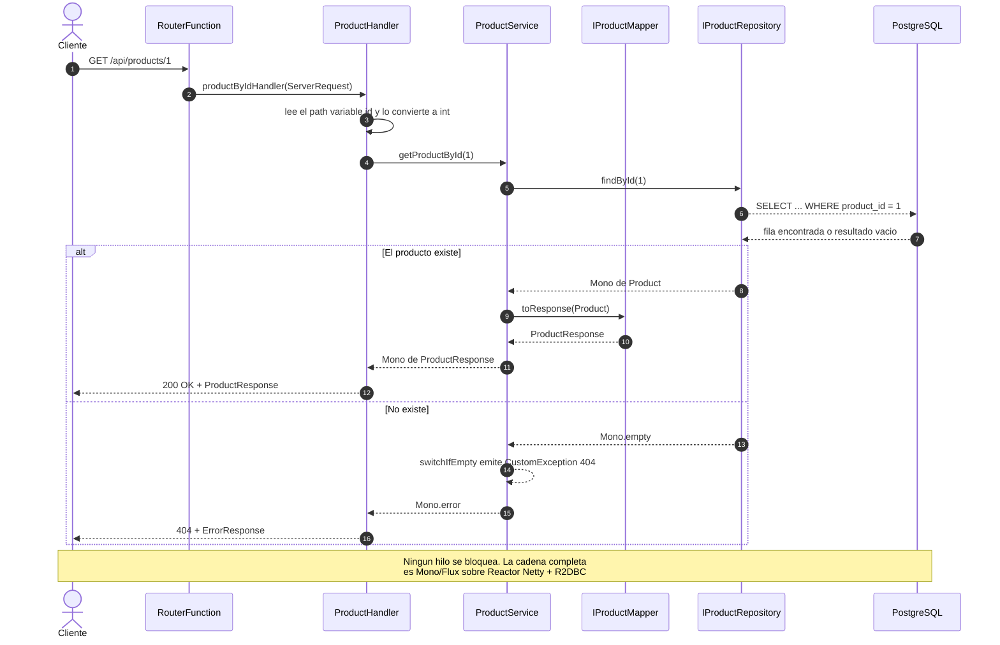
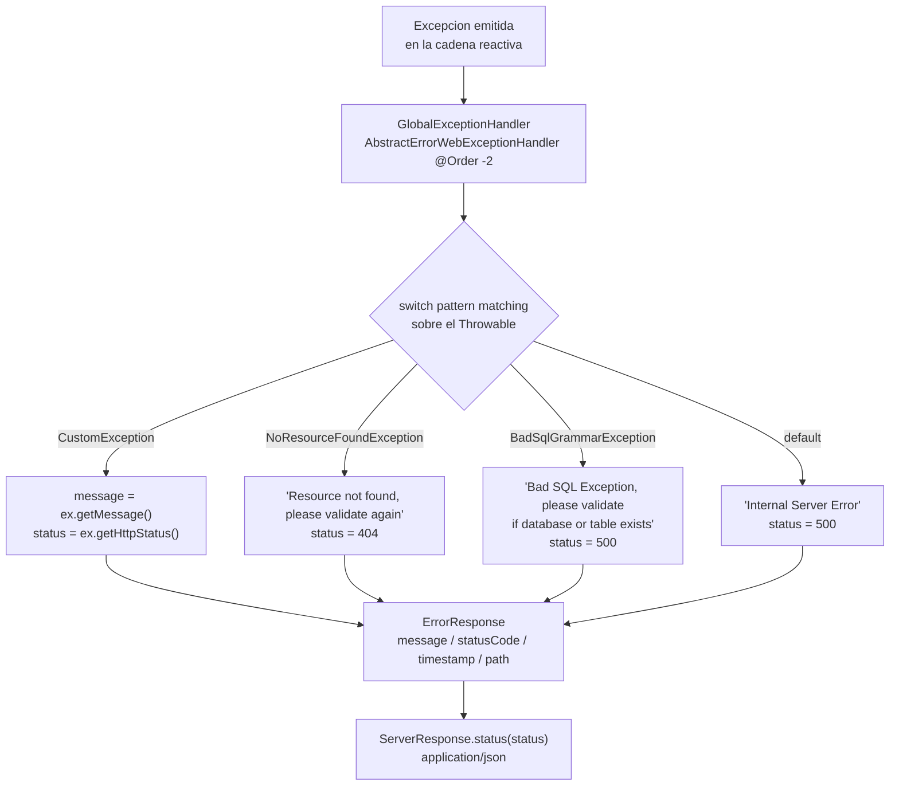
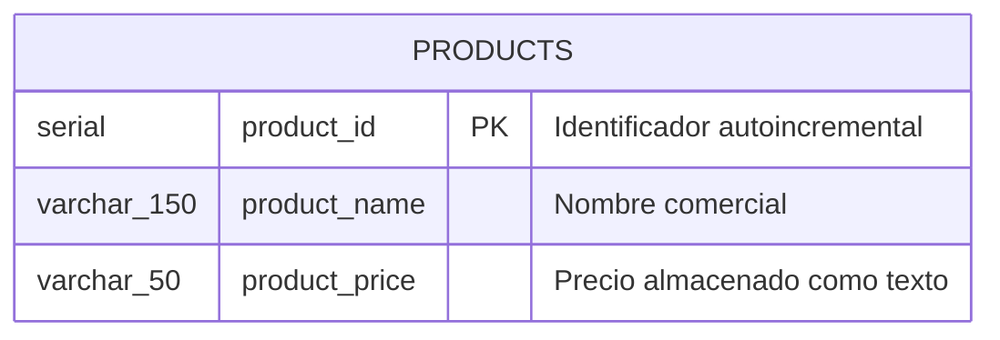
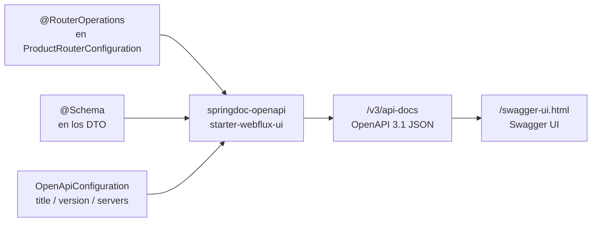

# Arquitectura — asl-crud-spring-webflux

Documento de arquitectura del servicio CRUD reactivo de productos.
Los diagramas están escritos en [Mermaid](https://mermaid.js.org/); GitHub, GitLab e IntelliJ
los renderizan directamente. Cada uno vive además como archivo independiente en
[`docs/diagrams/`](./diagrams) por si quieres exportarlo a PNG/SVG.

---

## 1. Visión general

El servicio expone un CRUD de productos sobre una arquitectura **totalmente no bloqueante**:
Reactor Netty en el borde, `Mono`/`Flux` en toda la cadena de negocio y R2DBC contra PostgreSQL.
No hay ningún salto a un pool de hilos bloqueante en el camino.

A diferencia del enfoque clásico con `@RestController`, aquí las rutas se declaran de forma
**funcional** (`RouterFunction` + `HandlerFunction`), lo que separa el *qué se expone*
(`ProductRouterConfiguration`) del *cómo se responde* (`ProductHandler`).

| Decisión | Elección | Por qué |
| --- | --- | --- |
| Estilo web | WebFlux funcional (`RouterFunction`) | Rutas declaradas en un solo lugar, handlers testeables sin contexto MVC |
| Acceso a datos | Spring Data R2DBC | Driver reactivo real; mantiene la cadena no bloqueante extremo a extremo |
| Mapeo DTO ↔ entidad | MapStruct | Mapeo en tiempo de compilación, sin reflexión ni coste en runtime |
| Errores | `AbstractErrorWebExceptionHandler` global | Un único contrato de error (`ErrorResponse`) para toda la API |
| Documentación | springdoc-openapi + `@RouterOperations` | Swagger UI para endpoints funcionales, que no se auto-documentan solos |
| Infraestructura local | `spring-boot-docker-compose` | La app levanta su propia base de datos al arrancar |

---

## 2. Diagrama de componentes

Cómo colaboran las piezas y en qué dirección fluye la dependencia.

```mermaid
flowchart LR
    subgraph CLIENTES["Clientes"]
        SW["Swagger UI<br/>/swagger-ui.html"]
        CLI["curl / Postman / Frontend"]
    end

    subgraph APP["asl-crud-spring-webflux &nbsp;&#58;9091"]
        direction TB

        subgraph WEB["Capa web (funcional)"]
            RT["ProductRouterConfiguration<br/>RouterFunction + @RouterOperations"]
            HD["ProductHandler<br/>ServerRequest &rarr; ServerResponse"]
        end

        subgraph NEG["Capa de negocio"]
            IS["IProductService<br/>contrato"]
            SV["ProductService<br/>reglas + errores de dominio"]
            MP["IProductMapper<br/>MapStruct"]
        end

        subgraph DAT["Capa de datos"]
            RP["IProductRepository<br/>ReactiveCrudRepository"]
            EN["Product<br/>@Table products"]
        end

        subgraph TRANS["Transversal"]
            EX["GlobalExceptionHandler<br/>@Order -2"]
            OA["OpenApiConfiguration<br/>springdoc-openapi"]
        end
    end

    DB[("PostgreSQL 17<br/>crud_db.public.products")]

    SW  --> RT
    CLI --> RT
    RT  --> HD
    HD  --> IS
    IS  -.implementa.-> SV
    SV  --> MP
    SV  --> RP
    RP  --> EN
    RP  -- "R2DBC / no bloqueante" --> DB

    SV  -. "CustomException" .-> EX
    HD  -. "cualquier error" .-> EX
    EX  -- "ErrorResponse JSON" --> CLIENTES
    OA  -. "lee anotaciones" .-> RT
    OA  -- "OpenAPI 3.1" --> SW
```



### Responsabilidad de cada componente

| Componente | Paquete | Responsabilidad |
| --- | --- | --- |
| `CrudWebflux` | `asl.development` | Punto de entrada `@SpringBootApplication` |
| `ProductRouterConfiguration` | `…controllers` | Declara las 5 rutas y su documentación OpenAPI |
| `ProductHandler` | `…handler` | Traduce HTTP ↔ dominio: lee path variables y body, arma la `ServerResponse` |
| `IProductService` / `ProductService` | `…service` | Reglas de negocio: existencia del producto, mensajes y códigos de resultado |
| `IProductMapper` | `…mapper` | `Product` ↔ `ProductRequest` / `ProductResponse` (implementación generada por MapStruct) |
| `IProductRepository` | `…repository` | CRUD reactivo sobre `products` (heredado de `ReactiveCrudRepository`) |
| `Product` | `…domain.entity` | Entidad R2DBC mapeada a `public.products` |
| `ProductRequest` | `…domain.request` | Payload de entrada de creación/actualización |
| `ProductResponse` / `ProductResponseInfo` | `…domain.response` | Salida de lectura / acuse de operación de escritura |
| `ErrorResponse` | `…domain.response` | Contrato único de error |
| `CustomException` | `…exception` | Excepción de dominio que ya carga su `HttpStatus` |
| `GlobalExceptionHandler` | `…configuration` | Convierte cualquier excepción en un `ErrorResponse` |
| `OpenApiConfiguration` | `…configuration` | Metadatos del documento OpenAPI (título, versión, servidor) |

---

## 3. Flujo de una petición

Recorrido completo de una lectura, incluyendo la rama de error.



### Particularidades por operación

- **`createProduct`** — no hace `findById` previo; mapea la petición a entidad, guarda y descarta
  el resultado (`map(ignored -> …)`) para devolver únicamente el acuse `ProductResponseInfo`.
- **`updateProduct`** — es una **actualización parcial**. El mapper usa
  `NullValuePropertyMappingStrategy.IGNORE`, así que los campos que lleguen en `null`
  conservan su valor actual en la base de datos.
- **`deleteProduct`** — verifica existencia antes de borrar, de modo que un id inexistente
  devuelve `404` en lugar de un `200` silencioso.
- **`getAllProducts`** — el handler hace `collectList()`, por lo que la respuesta es un array JSON
  completo y no un stream. Con catálogos grandes esto materializa todo en memoria.

---

## 4. Manejo de errores

`GlobalExceptionHandler` se registra con `@Order(-2)`, por delante del manejador por defecto de
Spring Boot, e intercepta **todas** las rutas (`RequestPredicates.all()`). Usa *pattern matching*
sobre el `Throwable` para decidir mensaje y código.



Toda respuesta de error tiene la misma forma:

```json
{
  "message": "Product not found",
  "statusCode": 404,
  "timestamp": "2026-08-19T20:43:11.842355699Z",
  "path": "/api/products/99"
}
```

---

## 5. Modelo de datos



Correspondencia entre la tabla, la entidad y los DTO:

| Columna | `Product` (entidad) | `ProductRequest` | `ProductResponse` |
| --- | --- | --- | --- |
| `product_id` | `Integer id` (`@Id`) | — | `id` |
| `product_name` | `String name` | `name` | `productName` |
| `product_price` | `String price` | `price` | `productPrice` |

El renombrado `name → productName` y `price → productPrice` lo resuelve `IProductMapper` con
`@Mapping`; la entidad nunca sale de la capa de servicio.

> **Nota de diseño:** `product_price` se almacena como texto (`VARCHAR`). Para operaciones
> aritméticas, ordenamiento por precio o validaciones monetarias conviene migrar a
> `NUMERIC(12,2)` y a `BigDecimal` en la entidad.

El esquema lo crea [`docker/init-db.sql`](../docker/init-db.sql), que Postgres ejecuta
automáticamente la primera vez que se crea el volumen de datos.

---

## 6. Entorno local y arranque

La aplicación gestiona su propia base de datos: `spring-boot-docker-compose` detecta
`docker-compose.yml`, levanta el contenedor, espera al *healthcheck* y sólo entonces
inyecta host, puerto y credenciales como `R2dbcConnectionDetails`.

```mermaid
flowchart TB
    DEV["Desarrollador<br/>mvn spring-boot:run"] --> BOOT

    subgraph HOST["Maquina local"]
        BOOT["Spring Boot 4.0.4<br/>spring-boot-docker-compose"]
        APP["Reactor Netty&nbsp;&#58;9091<br/>Swagger UI + API"]

        subgraph DOCKER["Docker Engine"]
            PG["crud-webflux-postgres<br/>postgres:17-alpine&nbsp;&#58;5432"]
            VOL[("crud-webflux-postgres-data<br/>volumen persistente")]
        end
    end

    BOOT -- "1&#46; lee docker-compose.yml<br/>y levanta el servicio" --> PG
    PG -- "2&#46; healthcheck pg_isready" --> BOOT
    BOOT -- "3&#46; inyecta host/puerto/credenciales<br/>como R2dbcConnectionDetails" --> APP
    APP -- "r2dbc:postgresql" --> PG
    PG --- VOL
    PG -. "solo en el primer arranque" .-> INIT["docker/init-db.sql<br/>crea tabla products + seed"]
```



Consecuencia importante: mientras `spring.docker.compose.enabled=true`, los valores de
`spring.r2dbc.*` en `application.properties` quedan **sobrescritos** por los del contenedor.
Sirven de respaldo para cuando se apaga la gestión de Docker (`spring.docker.compose.enabled=false`)
y se apunta a una base de datos externa.

---

## 7. Documentación de la API (springdoc)

Los endpoints funcionales **no se auto-documentan**: springdoc no puede inspeccionar una
`RouterFunction` como lo hace con un `@RestController`. Por eso `ProductRouterConfiguration`
declara `@RouterOperations`, con una entrada `@RouterOperation` por ruta que describe método,
path, parámetros, body y respuestas.



**Al agregar una ruta nueva hay que añadir también su `@RouterOperation`**, o quedará expuesta
pero invisible en Swagger UI.

---

## 8. Deuda técnica y siguientes pasos

Puntos detectados al documentar, en orden de impacto:

1. **Sin validación de entrada.** `ProductRequest` acepta `name`/`price` en `null` o vacíos;
   la creación fallaría con `500` por restricción `NOT NULL`. Se resuelve con
   `spring-boot-starter-validation` + `@NotBlank` y validación explícita en el handler.
2. **`Integer.parseInt` sin protección.** Un id no numérico (`/api/products/abc`) lanza
   `NumberFormatException` y cae en el `default` del manejador global: `500` en lugar de `400`.
3. **Ruta de listado con barra final.** El listado está registrado como `/api/products/`,
   mientras que la creación usa `/api/products`. Unificar ambos evitaría `404` inesperados.
4. **`price` como texto.** Ver la nota de la sección 5.
5. **Sin pruebas.** No existe `src/test`. `WebTestClient` sobre la `RouterFunction` y
   Testcontainers para la capa R2DBC cubrirían el flujo completo.
6. **`getAllProducts` materializa todo en memoria** por el `collectList()`. Devolver el `Flux`
   directamente con `ServerResponse.body(...)` escalaría mejor en catálogos grandes.

---

## Índice de diagramas

| Archivo | Contenido |
| --- | --- |
| [`01-arquitectura-componentes.mmd`](./diagrams/01-arquitectura-componentes.mmd) | Componentes y dependencias |
| [`02-secuencia-crud.mmd`](./diagrams/02-secuencia-crud.mmd) | Secuencia de una petición |
| [`03-manejo-errores.mmd`](./diagrams/03-manejo-errores.mmd) | Traducción de excepciones a `ErrorResponse` |
| [`04-modelo-datos.mmd`](./diagrams/04-modelo-datos.mmd) | Modelo entidad-relación |
| [`05-despliegue-local.mmd`](./diagrams/05-despliegue-local.mmd) | Arranque del entorno local |
